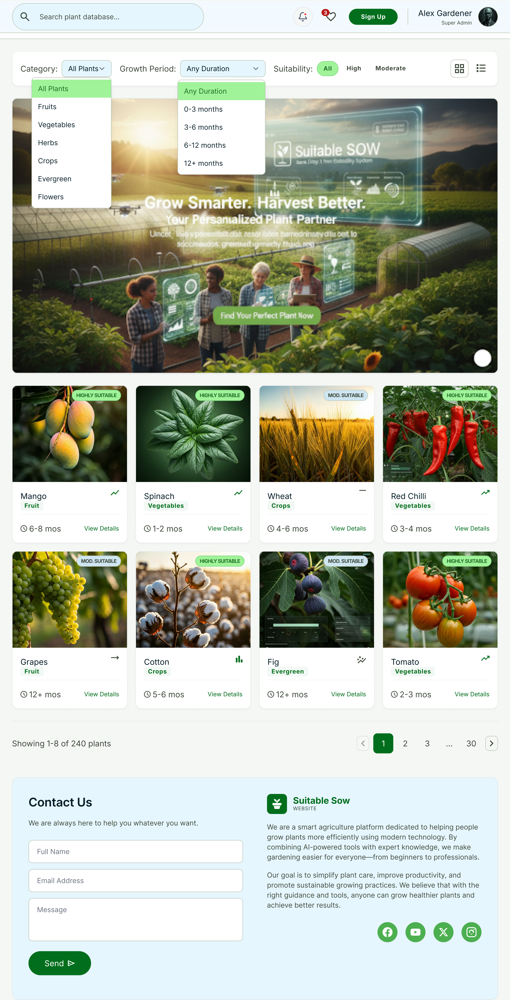
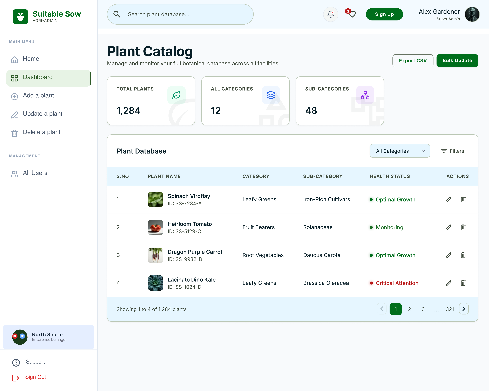
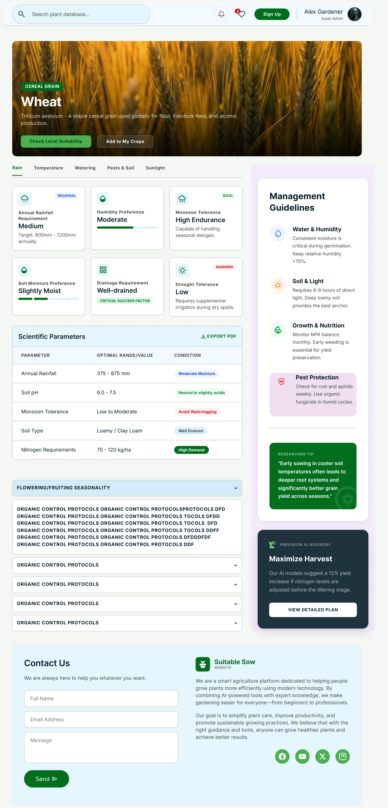
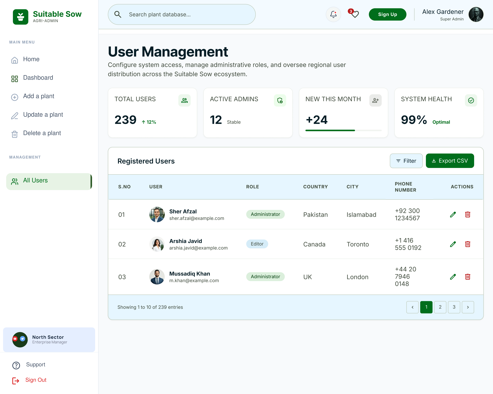

# 🌱 Plant Suitability System

A web-based **Plant Suitability System** developed with Laravel that helps users identify and explore plants based on environmental, soil, and growing conditions.

The system provides a plant catalog, suitability information, filtering, plant details, and an administrative interface for managing plant and user data.

## 📌 Project Overview

The **Plant Suitability System** is designed to help farmers, gardeners, and plantation enthusiasts determine which plants are suitable for particular environmental conditions.

Users can explore plants and view important growing requirements such as:

* 🌡️ Temperature
* 🌧️ Rainfall
* 💧 Soil moisture
* 🌱 Soil type
* 🧪 Soil pH
* ☀️ Sunlight requirements
* 🚿 Watering requirements
* 🌾 Growing season
* ⏳ Growth period
* 🌿 Plant category
* 📍 Geographic/environmental suitability

The system also provides an **admin dashboard** where administrators can manage plants and users.

## ✨ Key Features

### 👨‍🌾 User Features

* User registration and login
* User profile management
* Search plants
* Filter plants by category
* Filter plants by growing season
* View detailed plant information
* View plant suitability requirements
* Explore plants based on environmental conditions

### 🌱 Plant Catalog

The plant catalog provides structured information about different plants, including:

* Plant name
* Scientific name
* Category
* Sub-category
* Suitability
* Growth period
* Growing season
* Sunlight requirement
* Environmental requirements
* Plant image

### 🛠️ Admin Dashboard

Administrators can:

* Manage users
* Add new plants
* Update plant information
* Delete plants
* View plant records
* Filter plant records
* Manage plant categories
* Export plant data
* Monitor system information through the dashboard

### 🔎 Search & Filtering

The system supports plant discovery through:

* Plant name search
* Category filtering
* Growing-season filtering
* Suitability-based filtering
* Pagination

## 🖥️ Screenshots

### 🏠 Homepage



### 🌱 Plant Catalog



### 🌿 Plant Details



### 📊 Admin Dashboard



## 🧰 Technologies Used

### Backend

* **Laravel**
* **PHP**
* **MySQL**
* **Eloquent ORM**

### Frontend

* **HTML5**
* **CSS3**
* **JavaScript**
* **Tailwind CSS**
* **Blade Templates**

### Development Tools

* Composer
* NPM
* Vite
* Git
* GitHub
* MySQL / MySQL Workbench
* Visual Studio Code

### APIs

The project can integrate environmental and plant-related APIs to retrieve relevant geographic, weather, or plant information.

## 🏗️ Project Architecture

The application follows the Laravel MVC architecture:

Plant Suitability System
│
├── Models
│   ├── User
│   ├── Plant
│   └── Other application models
│
├── Controllers
│   ├── PlantController
│   ├── PlantCatalogController
│   ├── AddPlantController
│   └── Other controllers
│
├── Views
│   ├── Homepage
│   ├── Plant Catalog
│   ├── Plant Details
│   ├── Authentication
│   └── Admin Dashboard
│
├── Database
│   ├── Migrations
│   └── Seeders
│
└── Public
    └── Assets
        └── Images
```


## 📂 Important Project Structure

```text
app/
├── Http/
│   └── Controllers/
├── Models/
└── ...

database/
├── migrations/
└── seeders/

public/
├── assets/
│   └── images/
│       └── home_plants/
└── ...

resources/
├── views/
│   ├── admin/
│   ├── plants/
│   └── ...
└── ...

routes/
└── web.php

README.md
composer.json
package.json
```

---

## ⚙️ Installation & Setup

Follow the steps below to run the project locally.

### 1. Clone the Repository

...bash
git clone https://github.com/sherafzal5748/plant-suitability-system.git
```

Move into the project directory:

```bash
cd plant-suitability-system
```

### 2. Install PHP Dependencies

```bash
composer install
```

### 3. Install Frontend Dependencies

```bash
npm install
```

### 4. Create Environment File

Copy the example environment file:

```bash
cp .env.example .env
```

On Windows, you can also create a copy of `.env.example` and rename it to:

```text
.env
```

### 5. Generate Application Key

```bash
php artisan key:generate
```

### 6. Configure Database

Open the `.env` file and configure your MySQL database:

```env
DB_CONNECTION=mysql
DB_HOST=127.0.0.1
DB_PORT=3306
DB_DATABASE=plant_suitability
DB_USERNAME=root
DB_PASSWORD=
```

Update these values according to your local MySQL configuration.

### 7. Run Database Migrations

the project contains seed data, run:

```bash
php artisan db:seed
```

Or:

```bash
php artisan migrate --seed
```

### 8. Create Storage Link

the application uses Laravel storage:

```bash
php artisan storage:link
```

### 9. Start Laravel Development Server

```bash
php artisan serve
```

The application will normally be available at:

http://127.0.0.1:8000


## 🔐 Environment Variables

The `.env` file contains environment-specific configuration.

Important variables include:

```env
APP_NAME="Plant Suitability System"
APP_ENV=local
APP_KEY=
APP_DEBUG=true
APP_URL=http://localhost

DB_CONNECTION=mysql
DB_HOST=127.0.0.1
DB_PORT=3306
DB_DATABASE=plant_suitability
DB_USERNAME=root
DB_PASSWORD=
```

## 🗄️ Database

The application uses **MySQL** as its relational database.

The database contains entities related to:

* Users
* Plants
* Plant details
* Whitelist
* Messages/comments

## 🔄 Application Workflow

User
  │
  ▼
Homepage
  │
  ├── Search Plant
  │
  ├── Browse Plant Catalog
  │
  └── Apply Filters
          │
          ▼
     Plant Results
          │
          ▼
     Plant Details
          │
          ▼
  Suitability Information
```

### Admin Workflow

Admin
  │
  ▼
Admin Login
  │
  ▼
Dashboard
  │
  ├── Manage Users
  │
  ├── Add Plant
  │
  ├── Update Plant
  │
  ├── Delete Plant
  │
  └── Export Plant Data
```

---

## 🎯 Project Objectives

The main objectives of the system are:

1. Provide users with easily accessible plant information.
2. Help users understand plant environmental requirements.
3. Make plant discovery easier through search and filtering.
4. Organize plant information in a structured database.
5. Provide administrators with an efficient plant management system.
6. Demonstrate the practical implementation of Laravel MVC architecture.
7. Integrate web technologies and APIs for an intelligent plant suitability platform.

---

## 🚀 Future Improvements

Possible future enhancements include:

* 🌦️ Real-time weather integration
* 📍 Location-based plant recommendations
* 🤖 AI-based plant recommendations
* 📸 Plant identification using images
* 🗺️ Interactive geographic suitability maps
* 📊 Environmental suitability scoring
* 🌱 More comprehensive plant databases
* 📱 Responsive mobile-focused interface
* 🔔 Plant care reminders
* 🌤️ Automatic weather-based recommendations

---

## 🔒 Security

The application follows Laravel's built-in security mechanisms, including:

* Authentication
* Password hashing
* CSRF protection
* Input validation
* Eloquent ORM
* Environment variable configuration
* Protected application secrets

## 🤝 Contributing

 suggestions are welcome.

## 👨‍💻 Author

**Sher Afzal**

Software Engineering / Web Development

### Technologies & Skills

HTML • CSS • JavaScript • PHP • Laravel
React • Vue • Tailwind CSS • MySQL
REST APIs • AJAX • Git • GitHub

## 📄 License

This project is developed for educational, portfolio, and demonstration purposes.

## ⭐ Support

If you find this project useful or interesting, consider giving the repository a ⭐ on GitHub.
